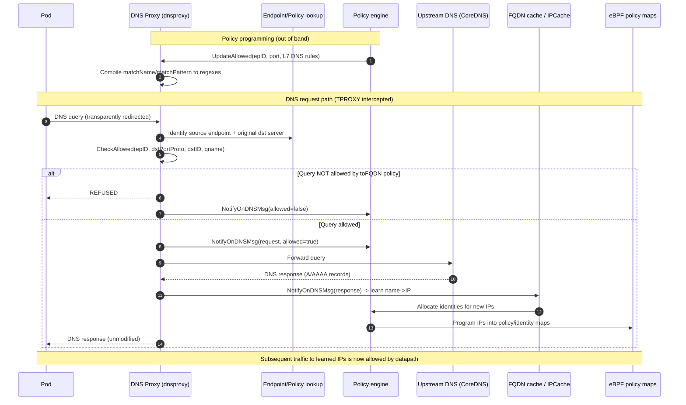
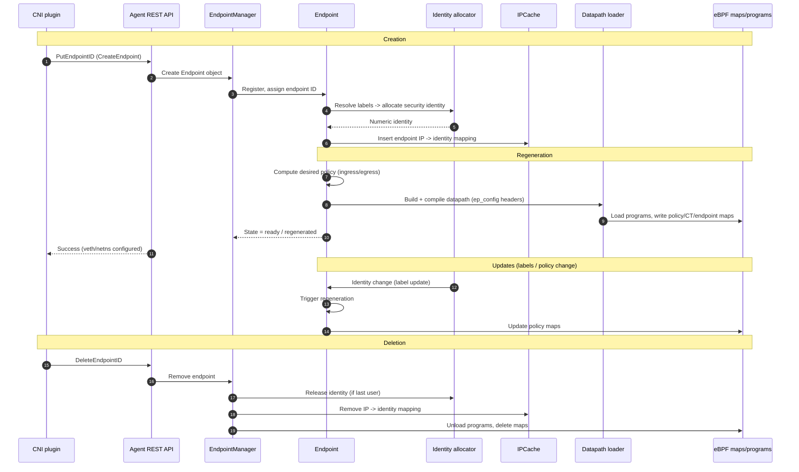
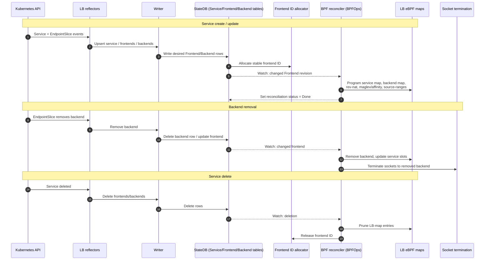
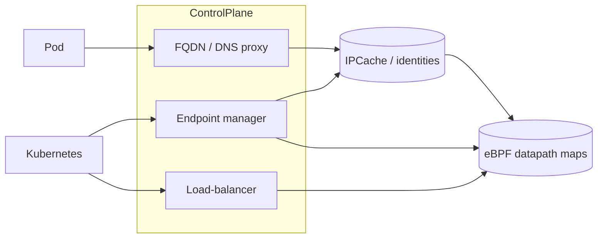

# Cilium-Agent Lifecycle Sequence Diagrams

Web-sequence (Mermaid) diagrams for three core cilium-agent flows: **FQDN/DNS-proxy**,
**Endpoint lifecycle**, and **Load-balancer lifecycle**.

---

## 1. FQDN / DNS Proxy flow

How `toFQDN` policy is enforced and how name→IP mappings are learned. Source references:
[ServeDNS](pkg/fqdn/dnsproxy/proxy.go#L895), [CheckAllowed](pkg/fqdn/dnsproxy/proxy.go#L763),
[UpdateAllowed](pkg/fqdn/dnsproxy/proxy.go#L723).

---

## 2. Endpoint lifecycle

From CNI pod creation through identity allocation, regeneration, and deletion.
Driven via the agent REST API (`PutEndpointID` / `DeleteEndpointID`) and the
`endpoint` + `endpointmanager` cells.

---

## 3. Load-balancer lifecycle

How a Kubernetes Service becomes eBPF LB-map entries via reflectors, StateDB tables,
and the BPF reconciler. Source references:
[loadbalancer reconciler Cell](pkg/loadbalancer/reconciler/cell.go),
[BPFOps](pkg/loadbalancer/reconciler/bpf_reconciler.go), [id_allocator](pkg/loadbalancer/reconciler/id_allocator.go).

---

## How the three connect

- **FQDN** learns IPs and feeds identities into IPCache.
- **Endpoint lifecycle** allocates identities and programs per-pod policy.
- **Load-balancer** programs service→backend translation.

All three ultimately converge on the **eBPF datapath maps** that enforce traffic decisions.
