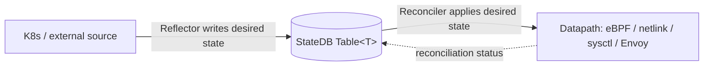
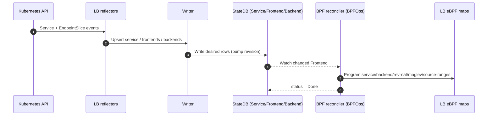
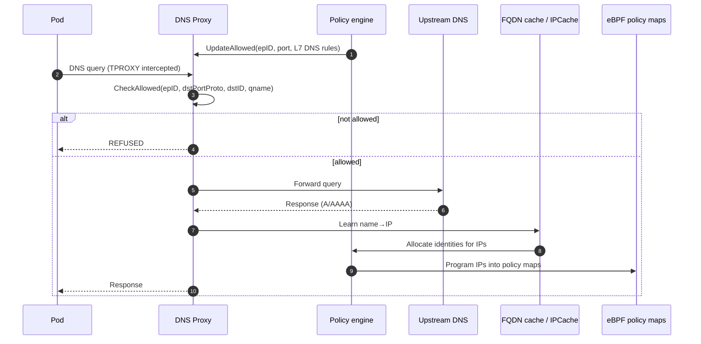
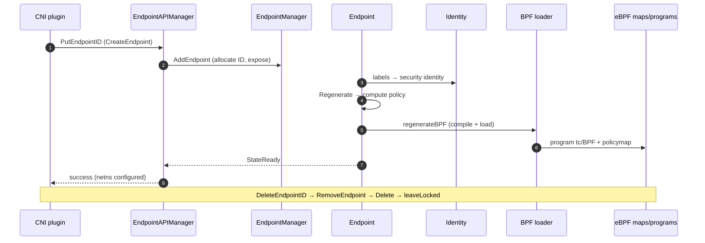
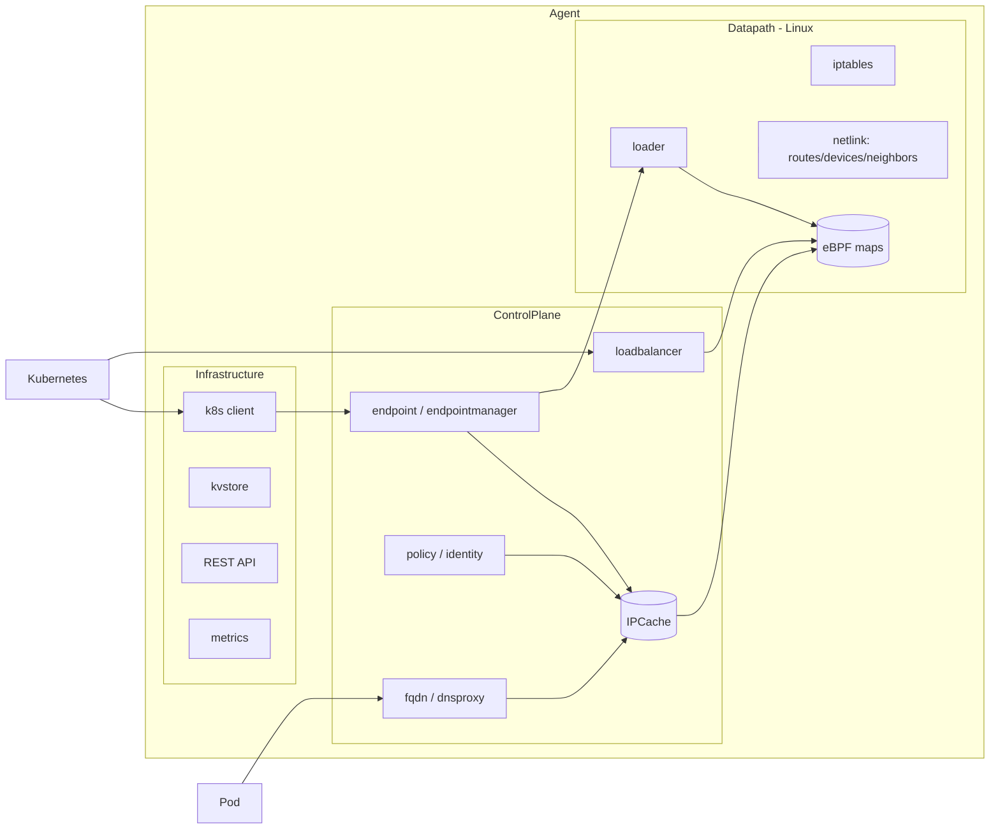
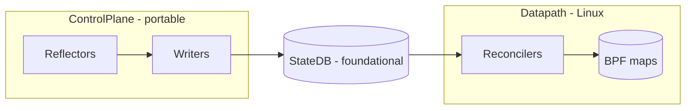

# Cilium-Agent — Components, Architecture & Data Flow

A consolidated overview of the **cilium-agent** project: what it does, how it is built, the
components it is composed of, how data flows through it, sequence diagrams for the core
lifecycles, and — since this tree is being ported to Windows — whether each part is
**Linux-dependent**.

---

## 1. What is cilium-agent?

Cilium-agent is the **per-node daemon** of [Cilium](https://github.com/cilium/cilium). It
provides **networking, load-balancing, network security (policy), and observability** for
Kubernetes pods, using an **eBPF datapath** in the Linux kernel (kube-proxy replacement,
identity-based policy, encryption, Hubble flow visibility, etc.).

One instance runs on every node (as a DaemonSet). It:
- Watches Kubernetes (and other sources) for desired state.
- Translates that into **identities**, **services/backends**, **policy**, **routes**.
- Programs the **eBPF maps and programs** (and netlink/iptables) that actually enforce it.
- Configures pod networking on CNI ADD/DEL.
- Runs L7 proxies (DNS proxy, Envoy) for L7 policy and FQDN.

## 2. How it works (architecture)

The agent is assembled as a **Hive dependency-injection graph**. The top-level `Agent` cell
([daemon/cmd/cells.go#L102](daemon/cmd/cells.go#L102)) is three modules:

```
Agent = Infrastructure  +  ControlPlane  +  Datapath
```

- **Infrastructure** — how the agent talks to the outside (K8s client, kvstore, REST API, metrics).
- **ControlPlane** — the "brains": compute identities, policy, services, endpoints. Pure business logic, mockable for tests.
- **Datapath** — the "hands": turn intent into eBPF maps, iptables, routes, neighbors. The Linux-coupled part.

The dominant internal pattern is **StateDB reflect → reconcile**:



- **Reflectors** translate external events into StateDB table rows (input side).
- **Reconcilers** (`statedb/reconciler`, `Operations[T]`) drive the datapath to match the table (output side), recording per-row status.
- Some paths are **API-driven** instead (endpoint lifecycle via CNI → REST API), and some are **request-driven** (DNS proxy).

---

## 3. Component list

Legend for **Linux-dependent?** — **Yes** = requires eBPF/netlink/iptables/procfs/netns;
**Partial** = control logic is portable but it programs a Linux datapath / BPF map;
**No** = platform-neutral.

### 3a. Infrastructure

| Component | What it does | Linux-dependent? |
|---|---|:--:|
| `pprof`, `gops` | Runtime profiling / process diagnostics | No |
| `k8sClient` | Kubernetes API client (Clientset) | No |
| `kvstore` | etcd client backend | No |
| `dial.ServiceResolver` | Resolve K8s service DNS → ClusterIP (etcd/clustermesh) | No |
| `cni` | CNI configuration management | Partial |
| `metrics` | Prometheus registry + HTTP server | No |
| `metricsmap`, `iptrace`, `ratelimitmap` | Datapath drop/forward, IP-trace, ratelimit metrics | Yes (BPF) |
| `server` (API) | REST API over UNIX socket (used by `cilium` CLI) | No |
| `store` | KVStore sync helpers | No |
| `hiveHealth.History`, `healthz`, `shell` | Health history, healthz endpoints, inspection shell | No |

### 3b. ControlPlane

| Component | What it does | Linux-dependent? |
|---|---|:--:|
| **`endpoint` / `endpointmanager`** | **Endpoint lifecycle** — manage per-pod endpoints, IDs, regeneration | Partial (programs BPF) |
| `infraendpoints` | Host/health/ingress endpoints + IP alloc | Yes |
| `endpointRestore`, `hostIPSync` | Restore endpoints at startup; sync host IPs to lxc map | Yes |
| **`loadbalancer`** | **Service load-balancing** control plane (reflect→table→reconcile) | Partial (reconciler = BPF) |
| `maglev` | Maglev consistent-hash table computation | No |
| `lbipamconfig`, `nodeipamconfig` | LB-IPAM / Node-IPAM config | No |
| **`fqdn`** | **DNS proxy** — `toFQDN` policy + name→IP learning | Yes (TPROXY) |
| `proxy` | Proxy-port allocation + L7 "redirect" abstraction | Yes |
| `envoy` | Control plane for embedded Envoy (Ingress/GW/L7) | Partial |
| `ciliumenvoyconfig` | CiliumEnvoyConfig CRD → Envoy xDS | No (xDS/gRPC) |
| `identity` | Allocate & manage security identities | No |
| `ipcache` | IP → identity mappings | Partial (BPF sync) |
| `ipam` | IP address management | No |
| `policy` / `compute` | Policy repository + policy computation | No |
| `policyK8s` / `policyDirectory` | K8s + file policy watchers | No |
| `auth` | Per-request mutual auth (SPIRE) | Partial (authmap BPF) |
| `bgp` | BGP control plane (GoBGP) | Partial |
| `egressgateway` | Egress Gateway (SNAT from specific IPs) | Yes (BPF) |
| `ipmasq` / `ipmasqmaps` | ip-masq-agent rules + maps | Yes (BPF) |
| `kpr` | kube-proxy-replacement config/init | Yes |
| `clustermesh` | Multi-cluster | No |
| `l2announcer` | Resolve L2 announcement policies → IPs+netdevs | Yes |
| `nodeManager` / `nodediscovery` / `neighbordiscovery` | Track cluster nodes; publish local node; forwardable IPs | Partial |
| `cgroup` | Cgroup metadata for pods/containers | Yes (cgroupfs) |
| `natStats` | NAT BPF-map stats/tables | Yes (BPF) |
| `signal` | Broker datapath signals from signalmap | Yes (BPF) |
| `subnet` | Subnet→identity map (hybrid routing) | Yes (BPF) |
| `ztunnel` | xDS server for zTunnel (Istio ambient) | Yes (netns) |
| `hubble` | Hubble servers + metrics (observability) | Partial |
| `watchers` | Core K8s watchers | No |
| `dynamicconfig` / `dynamiclifecycle` / `driftchecker` | Watchable config, dynamic feature lifecycle, drift metric | No |
| `features`, `source`, `status`, `debugapi`, `restapi`, `svcrouteconfig` | Feature metrics, source priority, status, debug/REST APIs, service routes | No |
| `health` / `healthconfig` | Host & endpoint connectivity health probing | Partial |

### 3c. Datapath — programs the kernel (essentially all Linux)

| Component | What it does | Linux-dependent? |
|---|---|:--:|
| `maps`, `mapsweeper` | All BPF maps + stale-map cleanup | Yes |
| `loader` | Compile & load eBPF datapath programs | Yes |
| `iptables` | Cilium iptables rules | Yes |
| `sysctl` | Reconcile kernel sysctls (`/proc/sys`) | Yes |
| `wg` | WireGuard agent (device + peers) | Yes |
| `ipsec` | IPsec agent | Yes |
| `bandwidth` / `bwmap` | EDT rate-limiting (tc qdisc + throttle map) | Yes |
| `bigtcp`, `tunnel`, `mtu`, `vtep` | BIG TCP, tunnel config, MTU, VXLAN endpoints | Yes |
| `DevicesController` / `routeReconciler` / `deviceReconciler` | Devices & routes via netlink | Yes |
| `neighbor` / `l2responder` / `gneigh` | Neighbor entries, L2 responder map, gratuitous ARP | Yes |
| `prefilter` / `xdp` | XDP pre-filters (DDoS mitigation) | Yes |
| `monitorAgent` / `eventsmap` | Event map + monitor multicast | Yes |
| `connector` | Pod interface config (veth/netkit) | Yes |
| `orchestrator` | Datapath regeneration orchestration | Yes |
| `act`, `link`, `agentliveness`, `utime`, `dpcfg` | ACT metrics, link cache, liveness, utime sync, config headers | Yes |
| `plugins` | CNI plugin registry | Yes |

---

## 4. Key components — how they work

### 4a. Load-balancer (`loadbalancer`) — reflect → reconcile

Kubernetes Services/EndpointSlices become eBPF LB-map entries.


**Linux-dependent:** control plane is portable; the reconciler writes eBPF maps (on Windows
= CNC datapath). See `cilium-lb-dataflow.md`.

### 4b. DNS proxy (`fqdn` / `dnsproxy`) — request-driven

Enforces `toFQDN` policy and learns name→IP mappings by intercepting pod DNS.


**Linux-dependent:** Yes — transparent interception uses Linux TPROXY (`IP_TRANSPARENT`,
`IP_RECVORIGDSTADDR`), `SO_MARK`, raw sockets. No Windows socket equivalent (WFP needed).

### 4c. Endpoint lifecycle (`endpoint` / `endpointmanager`) — API-driven

A pod becomes a fully-programmed endpoint via CNI → REST API → regeneration.


**Linux-dependent:** Partial — object/registry/identity logic is portable; regeneration
compiles & loads eBPF and programs veth/netkit + policy maps. See `cilium-endpoint-lifecycle.md`.

---

## 5. How the components connect



- **FQDN** learns IPs and feeds identities into IPCache.
- **Endpoint lifecycle** allocates identities and programs per-pod policy via the loader.
- **Load-balancer** programs service→backend translation into eBPF maps.
- All converge on the **eBPF datapath maps** (netlink/iptables) that enforce traffic decisions.

---

## 6. How the reflect→reconcile pieces are scattered across the modules

The five moving parts of the StateDB pattern — **reflectors, writers, StateDB, reconcilers,
BPF maps** — are deliberately spread so that the *portable* halves land in ControlPlane and
the *Linux* halves land in Datapath, with StateDB as the neutral hand-off.

**StateDB itself is foundational — not in any of the three modules.** `*statedb.DB` is
provided by the base Hive ([pkg/hive/hive.go#L66](pkg/hive/hive.go#L66), `statedb.Cell`,
next to `job.Cell`), which wraps `Infrastructure + ControlPlane + Datapath`. Tables from all
three modules register into the *same* DB instance.

| Piece | Infrastructure | ControlPlane | Datapath |
|---|---|---|---|
| **StateDB `*DB`** | — (base hive, below all three) | uses it | uses it |
| **Reflectors** (write desired state into tables) | K8s plumbing (`agentK8s.Resources`) feeds them | **most** — `loadbalancer/reflectors`, K8s `watchers` | some — `DevicesController`, `NodeAddress` controller reflect kernel state into tables |
| **Writers** (table-mutation API) | — | **yes** — `loadbalancer/writer` guards `Table[Service/Frontend/Backend]` | table owners write their own desired tables (device/route) |
| **Reconcilers** (`Operations[T]`) | — | some — `loadbalancer/reconciler`, `ciliumenvoyconfig`, `dynamiclifecycle`, `ztunnel` | **most** — `route`, `device`, `neighbor`, `sysctl`, `bandwidth`, `l2responder`, `bwmap`, `subnet`, `ipset` |
| **BPF maps** | metrics only — `metricsmap`, `iptrace`, `ratelimitmap` | `loadbalancer/maps` (`LBMaps`), `ipmasqmaps`, `natStats` | **the bulk** — `maps.Cell` registry (ctmap, policymap, lxcmap, nat, egress, signalmap…) + `loader` |



**The rule:** reflectors + writers cluster in ControlPlane; reconcilers + BPF maps cluster in
Datapath; StateDB sits underneath both.

**Exceptions worth remembering:**
1. **Load-balancer packages all five under ControlPlane.** `loadbalancer/cell`
   ([pkg/loadbalancer/cell/cell.go#L18](pkg/loadbalancer/cell/cell.go#L18)) groups reflectors
   *and* the reconciler *and* the `LBMaps` BPF wrapper together — even though the reconciler/maps
   program the datapath. (This is exactly why the Windows port swaps `LBMaps`→`CNCLBMaps` here,
   not in Datapath.)
2. **Datapath has its own reflectors.** `DevicesController` / `NodeAddress` reflect
   netlink state *into* tables (input side), then `route`/`device` reconcilers push desired
   state back out — so Datapath holds both halves of the pattern.
3. **Infrastructure only touches BPF maps for metrics** — no reflectors or reconcilers of its own.

---

## 7. Linux-dependency summary

- **Datapath module: entirely Linux** (eBPF, netlink, iptables, procfs, XDP, WireGuard, IPsec).
- **ControlPlane: mixed** — computation (identity, policy, maglev, clustermesh, IPAM) is
  portable; anything that *programs* the datapath or uses BPF maps / TPROXY / netns is Linux-bound.
- **Infrastructure: mostly portable** except BPF-backed metrics maps.
- **Fully platform-neutral** examples: `ciliumenvoyconfig`, `dynamiclifecycle`, `identity`,
  `policy`/`compute`, `ipam`, `clustermesh`, most K8s watchers and config cells.

## 8. Related docs (workspace root)

- `cilium-agent-reconcilers.md` — all StateDB reconcilers + Linux-dependency table.
- `cilium-agent-lifecycles.md` (+ `.pdf`) — FQDN / endpoint / load-balancer sequence diagrams.
- `cilium-lb-dataflow.md` — reflector → writer → StateDB → reconciler → eBPF maps trace + cell wiring.
- `cilium-endpoint-lifecycle.md` — CNI → API → creator → manager → regeneration → delete + cell wiring.
