# Cilium-Agent Reconcilers

These are the **StateDB reconcilers** (built on the `github.com/cilium/statedb/reconciler`
framework, i.e. `reconciler.Register` + `reconciler.Operations[T]`) that run inside the
cilium-agent. Each one watches a StateDB table of *desired* objects and drives the
underlying datapath / external system to match, recording per-object reconciliation status.

> Note: This list covers the generic StateDB reconciler framework. Cilium also has other
> components that use the word "reconciler" but follow different patterns (e.g. BGPv2 path
> reconcilers, endpoint regeneration). Those are out of scope here.

## Summary Table

| # | Reconciler | Package | Reconciled Table / Object | What it does | Linux-dependent? | Reason |
|---|------------|---------|---------------------------|--------------|:----------------:|--------|
| 1 | Generic BPF map ops | `pkg/bpf` (`ops_linux.go`) | any `KeyValue` BPF map entry | Reusable `reconciler.Operations` that syncs a StateDB table into an eBPF map (Update = map update, Delete = map delete, Prune = remove stale keys). Building block used by other reconcilers. | **Yes** | eBPF maps; file is `_linux.go` |
| 2 | Load-balancer BPF | `pkg/loadbalancer/reconciler` | `Table[*Frontend]` (`BPFOps`) | Reconciles services/frontends/backends into the LB eBPF maps (services, backends, rev-nat, affinity, maglev, source-ranges) and terminates sockets to removed backends. | **Yes** | eBPF LB maps, socket termination |
| 3 | Skip-LB (LRP) | `pkg/loadbalancer/redirectpolicy` (`skiplb.go`) | `Table[*desiredSkipLB]` | For Local Redirect Policy, programs the `cilium_skip_lb{4,6}` eBPF maps so selected pods bypass load-balancing. | **Yes** | eBPF skip-LB maps |
| 4 | Subnet map | `pkg/maps/subnet` | `Table[SubnetTableEntry]` | Syncs subnet→identity mappings into a BPF map so the datapath picks tunnel vs. native routing per subnet. Only active in **hybrid** routing mode. | **Yes** | eBPF map |
| 5 | Bandwidth map | `pkg/maps/bwmap` | bandwidth throttle entries | Reconciles per-endpoint bandwidth limits into the `cilium_throttle` eBPF map (EDT/bandwidth manager). | **Yes** | eBPF map |
| 6 | Bandwidth QDisc | `pkg/datapath/linux/bandwidth` | `Table[*tables.BandwidthQDisc]` | Installs/removes the MQ/FQ tc qdiscs on network devices required for EDT-based bandwidth enforcement. | **Yes** | tc qdisc via netlink |
| 7 | IPSet | `pkg/datapath/iptables/ipset` | `Table[*tables.IPSetEntry]` | Maintains kernel ipsets (used together with the iptables datapath, e.g. for masquerade/no-track sets). | **Yes** | kernel ipset / iptables |
| 8 | Device | `pkg/datapath/linux/device` | `Table[*DesiredDevice]` | Reconciles desired network device configuration/state against the actual Linux devices. | **Yes** | netlink devices |
| 9 | Route | `pkg/datapath/linux/route/reconciler` | `Table[*DesiredRoute]` | Programs Linux routing-table entries (routes) to match the desired routes table. | **Yes** | netlink routes |
| 10 | Sysctl | `pkg/datapath/linux/sysctl` | `Table[*tables.Sysctl]` | Applies kernel sysctl settings (writes under `/proc/sys`) to match desired values. | **Yes** | `/proc/sys` kernel sysctls |
| 11 | Neighbor | `pkg/datapath/neighbor` | `Table[*DesiredNeighbor]` | Manages L2 neighbor (ARP/NDP) entries for node/backend reachability. | **Yes** | netlink neigh |
| 12 | Ztunnel enrollment | `pkg/ztunnel/reconciler` | `Table[*EnrolledNamespace]` | Enrolls/un-enrolls pod network namespaces into the ztunnel (Istio ambient) datapath via xDS/zds. | **Yes** | network namespaces / ztunnel datapath |
| 13 | Cilium Envoy Config | `pkg/ciliumenvoyconfig` | `Table[*EnvoyResource]` (`envoyOps`) | Pushes Envoy listeners/clusters/routes (from CiliumEnvoyConfig) to the embedded Envoy via the xDS server and triggers policy updates. | **No** | Envoy xDS over gRPC; no kernel deps |
| 14 | Dynamic Lifecycle | `pkg/dynamiclifecycle` | `Table[*DynamicFeature]` | Starts/stops Hive feature lifecycles at runtime based on enablement flags and dependency checks. Pure control-plane bookkeeping. | **No** | Plain Go; no datapath/kernel deps |

## Linux dependency breakdown

**Linux-dependent (eBPF / netlink / procfs / iptables):**
1, 2, 3, 4, 5 (eBPF maps) · 6, 8, 9, 11 (netlink) · 7 (ipset/iptables) · 10 (procfs sysctl) · 12 (netns/ztunnel)

**Platform-neutral (no kernel dependency):**
13 (Envoy xDS) · 14 (Dynamic Lifecycle)

## How a StateDB reconciler works

```mermaid
flowchart LR
    A[Controllers / reflectors<br/>write desired state] --> B[(StateDB RWTable&lt;T&gt;)]
    B -->|watch changes| C[reconciler.Register]
    C -->|Update / Delete / Prune| D[reconciler.Operations&#91;T&#93;]
    D --> E[Datapath / external system<br/>eBPF map, netlink, sysctl,<br/>ipset, Envoy xDS, ...]
    D -->|reconciliation status| B
```

Each reconciler provides three table helpers — `clone`, `setStatus`, `getStatus` — plus an
`Operations[T]` implementation (`Update`, `Delete`, optional `Prune`). The framework retries
failed objects with backoff and records `Done`/`Error` status back onto each table object.
