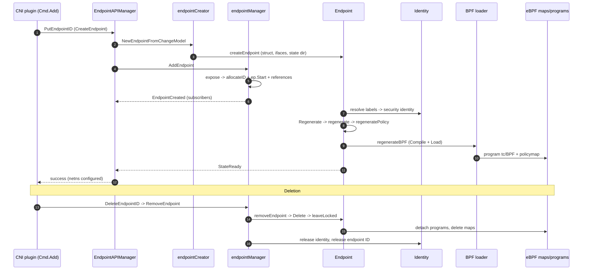

# Cilium Endpoint Lifecycle: CNI → API → Creator → Manager → Regeneration → Delete

This traces how a pod becomes a fully-programmed Cilium **endpoint** in cilium-agent, and
how it is torn down. Unlike the load-balancer flow (reflector → StateDB → reconciler), the
endpoint lifecycle is **API-driven**: the CNI plugin calls the agent's REST API, which
creates the endpoint object, registers it, and drives BPF regeneration.

---

## Hive cell wiring (who registers each stage)

Unlike load-balancing (reflector → StateDB → reconciler), the endpoint path has **no
reflector, StateDB table or reconciler** — it is API-driven. The equivalent Hive cells are
grouped by the endpoint meta cell [pkg/endpoint/cell/cell.go#L19](pkg/endpoint/cell/cell.go#L19)
(`cell.Group`). For comparison with the LB dataflow doc, the analogous roles are:

| Role (LB analogue) | Cell (Hive module) | Cell file | Provides |
|---|---|---|---|
| Ingress event source (≈ reflector) | `cni` | [daemon/cmd/cni/cell.go](daemon/cmd/cni/cell.go) | CNI ADD/DEL → agent REST API |
| Create API (≈ writer) | `endpoint-api` | [endpoint/api/cell.go#L29](pkg/endpoint/api/cell.go#L29) | `EndpointAPIManager.CreateEndpoint` |
| Object factory | `endpoint-creator` | [endpoint/creator/cell.go#L11](pkg/endpoint/creator/cell.go#L11) | `NewEndpointFromChangeModel` |
| Registry (≈ StateDB store) | `endpoint-manager` | [endpointmanager/cell.go#L39](pkg/endpointmanager/cell.go#L39) | `EndpointManager` (`AddEndpoint`/`expose`) |
| BPF programming (≈ reconciler + bpf maps) | `loader` | [datapath/loader/cell.go#L12](pkg/datapath/loader/cell.go#L12) | `Loader` used by `regenerateBPF` |

> The endpoint's regeneration is triggered internally (identity/policy change) rather than by
> a StateDB reconciler, so there is no `reconciler.Register` for endpoints — `regenerateBPF`
> calls the `loader` cell directly.

---

## 1. CNI ADD — the plugin calls the agent

When a pod is scheduled, the container runtime invokes the Cilium CNI plugin, which builds
an `EndpointChangeRequest` (container ID, netns, labels, IPAM addresses) and sends it to the
agent's REST API (`PutEndpointID`).

> [plugins/cilium-cni/cmd/cmd.go#L523](plugins/cilium-cni/cmd/cmd.go#L523)

```go
func (cmd *Cmd) Add(args *skel.CmdArgs) (err error) {
    // ... parse CNI args + netconf, allocate IPAM address(es) ...
    // build *models.EndpointChangeRequest (ContainerID, K8s metadata, Addressing, ...)
    // create veth/netkit pair via the connector
    // PUT the endpoint to the agent API -> CreateEndpoint (stage 2)
}
```

---

## 2. Agent REST API — `CreateEndpoint`

`EndpointAPIManager.CreateEndpoint` is the server-side handler. It parses the request into
an `Endpoint` (stage 3), rejects duplicates (by Cilium ID / CNI attachment / IP), filters
labels, and registers a create request before triggering identity resolution + regeneration.

> [pkg/endpoint/api/endpoint_api_manager.go#L88](pkg/endpoint/api/endpoint_api_manager.go#L88)

```go
func (m *endpointAPIManager) CreateEndpoint(ctx context.Context, epTemplate *models.EndpointChangeRequest) (*endpoint.Endpoint, int, error) {
    // ... EnableEndpointRoutes datapath tweaks ...
    apiLabels := labels.NewLabelsFromModel(epTemplate.Labels)
    epTemplate.Labels = nil

    ep, err := m.endpointCreator.NewEndpointFromChangeModel(epTemplate)   // -> stage 3
    // dedup checks: LookupCiliumID / LookupCNIAttachmentID / IP in use
    // APICanModify + reserved/generated label validation
    m.endpointCreations.NewCreateRequest(ep, cancel)
    // resolve K8s pod metadata + identity labels, then AddEndpoint (stage 4)
}
```

---

## 3. Endpoint object creation

The creator turns the API model into an in-memory `Endpoint` (interfaces, state dir, BPF map
references). `NewEndpointFromChangeModel` delegates to the package-level `createEndpoint`
factory.

> [pkg/endpoint/creator/creator.go#L95](pkg/endpoint/creator/creator.go#L95)

```go
func (c *endpointCreator) NewEndpointFromChangeModel(base *models.EndpointChangeRequest) (*endpoint.Endpoint, error) {
    // parse container ID, labels, IPs, datapath config from the model
    // -> createEndpoint(...) builds the Endpoint struct
}
```

> [pkg/endpoint/endpoint.go#L583](pkg/endpoint/endpoint.go#L583)

```go
func createEndpoint(
    // owner, policyGetter, ...
    ID uint16, ifName string, ...,
) *Endpoint {
    // allocate Endpoint struct + fields, interfaces, BPF map handles, state dir
}
```

---

## 4. Registration & expose

`AddEndpoint` publishes the endpoint globally. It calls `expose`, which allocates the unique
endpoint ID, starts the endpoint (`ep.Start`), registers lookup indices, kicks off health
monitoring and the K8s `CiliumEndpoint` sync, then notifies subscribers with
`EndpointCreated`.

> [pkg/endpointmanager/manager.go#L798](pkg/endpointmanager/manager.go#L798)

```go
func (mgr *endpointManager) AddEndpoint(ep *endpoint.Endpoint) (err error) {
    if ep.ID != 0 { return fmt.Errorf("Endpoint ID is already set to %d", ep.ID) }
    ep.UpdateLogger(...)                       // re-populate pod fields
    err = mgr.expose(ep)                        // allocate ID + start (below)
    ...
    mgr.monitorAgent.SendEvent(... EndpointCreateMessage(ep))
    for s := range mgr.subscribers { s.EndpointCreated(ep) }   // notify
    return nil
}
```

> [pkg/endpointmanager/manager.go#L692](pkg/endpointmanager/manager.go#L692)

```go
func (mgr *endpointManager) expose(ep *endpoint.Endpoint) error {
    newID, err := mgr.allocateID(ep.ID)        // unique uint16 endpoint ID
    ...
    ep.Start(newID)                            // start controllers/state machine
    mgr.mcastManager.AddAddress(ep.IPv6)
    mgr.updateIDReferenceLocked(ep)
    mgr.updateReferencesLocked(ep, identifiers)  // by IP/pod/containerID/CNI ID
    ...
    ep.InitEndpointHealth(mgr.health)
    mgr.RunK8sCiliumEndpointSync(ep, ep.GetReporter("cep-k8s-sync"))
    return nil
}
```

---

## 5. Regeneration — identity, policy & BPF

Once labels resolve to a **security identity**, the endpoint regenerates: compute the desired
policy, then compile and load the BPF datapath and program the policy map. `Regenerate`
queues an async build; `regenerate` runs it; `regenerateBPF` does the datapath work.

> [pkg/endpoint/policy.go#L867](pkg/endpoint/policy.go#L867)

```go
func (e *Endpoint) Regenerate(regenMetadata *regeneration.ExternalRegenerationMetadata) <-chan bool {
    // enqueue an async regeneration with a reason; returns a done channel
}
```

> [pkg/endpoint/policy.go#L458](pkg/endpoint/policy.go#L458)

```go
func (e *Endpoint) regenerate(ctx *regenerationContext) (retErr error) {
    // regeneratePolicy() -> compute SelectorPolicy -> EndpointPolicy
    // then regenerateBPF() (below), then transition to StateReady
}
```

> [pkg/endpoint/bpf.go#L357](pkg/endpoint/bpf.go#L357)

```go
func (e *Endpoint) regenerateBPF(regenContext *regenerationContext) (revnum uint64, reterr error) {
    // loader.Compile() -> loader.Load(): tc/BPF programs into the kernel
    // sync policymap (ingress/egress), CT/lxc maps; bump datapath revision
}
```

At the end of a successful regeneration the endpoint reaches **`StateReady`** and the CNI
`Add` call returns to the runtime.

---

## 6. Deletion — CNI DEL

`RemoveEndpoint` is the public teardown entry; it delegates to `removeEndpoint`, which calls
`ep.Delete` (detach tc/BPF, delete policy maps, iptables, interfaces) and `leaveLocked`
(release identity, DNS rules, controllers), releases the endpoint ID and notifies subscribers.

> [pkg/endpointmanager/manager.go#L526](pkg/endpointmanager/manager.go#L526)

```go
func (mgr *endpointManager) RemoveEndpoint(ep *endpoint.Endpoint, conf endpoint.DeleteConfig) []error {
    return mgr.removeEndpoint(ep, conf)   // -> below
}
```

> [pkg/endpointmanager/manager.go#L499](pkg/endpointmanager/manager.go#L499)

```go
func (mgr *endpointManager) removeEndpoint(ep *endpoint.Endpoint, conf endpoint.DeleteConfig) []error {
    // unexpose from lookup maps, ep.Delete() (below), release ID, notify EndpointDeleted
}
```

> [pkg/endpoint/endpoint.go#L2633](pkg/endpoint/endpoint.go#L2633)

```go
func (e *Endpoint) Delete(conf DeleteConfig) []error {
    // stop endpoint, detach tc BPF programs, delete BPF policy maps,
    // clean iptables rules, remove network interfaces; calls leaveLocked (below)
}
```

> [pkg/endpoint/endpoint.go#L1256](pkg/endpoint/endpoint.go#L1256)

```go
func (e *Endpoint) leaveLocked(conf DeleteConfig) []error {
    // detach policy, close policy maps, release security identity,
    // remove DNS rules, stop controllers
}
```

---

## End-to-end summary



| Stage | Function | File |
|---|---|---|
| CNI ADD | `Cmd.Add` | [cmd.go#L523](plugins/cilium-cni/cmd/cmd.go#L523) |
| API create | `CreateEndpoint` | [endpoint_api_manager.go#L88](pkg/endpoint/api/endpoint_api_manager.go#L88) |
| Build object | `NewEndpointFromChangeModel` / `createEndpoint` | [creator.go#L95](pkg/endpoint/creator/creator.go#L95), [endpoint.go#L583](pkg/endpoint/endpoint.go#L583) |
| Register | `AddEndpoint` / `expose` | [manager.go#L798](pkg/endpointmanager/manager.go#L798), [#L692](pkg/endpointmanager/manager.go#L692) |
| Regenerate | `Regenerate` → `regenerate` → `regenerateBPF` | [policy.go#L867](pkg/endpoint/policy.go#L867), [#L458](pkg/endpoint/policy.go#L458), [bpf.go#L357](pkg/endpoint/bpf.go#L357) |
| Delete | `RemoveEndpoint` → `removeEndpoint` → `Delete` → `leaveLocked` | [manager.go#L526](pkg/endpointmanager/manager.go#L526), [#L499](pkg/endpointmanager/manager.go#L499), [endpoint.go#L2633](pkg/endpoint/endpoint.go#L2633), [#L1256](pkg/endpoint/endpoint.go#L1256) |
