# Cilium Load-Balancer Data Path: Reflector → Writer → StateDB → Reconciler → eBPF Maps

This traces how a Kubernetes `Service` / `EndpointSlice` change becomes eBPF LB-map
entries in cilium-agent, through four stages.

---

## Hive cell wiring (who registers each stage)

All of the load-balancing control plane is assembled by the meta cell
[pkg/loadbalancer/cell/cell.go#L18](pkg/loadbalancer/cell/cell.go#L18) (`cell.Group`), which
wires together the individual cells below.

| Stage | Cell (Hive module) | Cell file | Provides |
|---|---|---|---|
| Reflector | `loadbalancer-reflectors` | [reflectors/cell.go#L15](pkg/loadbalancer/reflectors/cell.go#L15) · [K8sReflectorCell](pkg/loadbalancer/reflectors/k8s.go#L54) | K8s Service/EndpointSlice reflectors |
| Writer + StateDB tables | `loadbalancer-writer` | [writer/cell.go#L16](pkg/loadbalancer/writer/cell.go#L16) | `Writer` API + `Table[*Service/Frontend/Backend]` |
| StateDB table definitions | (constructors) | [service.go#L377](pkg/loadbalancer/service.go#L377) · [frontend.go#L302](pkg/loadbalancer/frontend.go#L302) · [backend.go#L218](pkg/loadbalancer/backend.go#L218) | `NewServicesTable` / `NewFrontendsTable` / `NewBackendsTable` |
| Reconciler | `loadbalancer-reconciler` | [reconciler/cell.go#L17](pkg/loadbalancer/reconciler/cell.go#L17) | `BPFOps` reconciler against `Table[*Frontend]` |
| BPF maps (`LBMaps`) | `loadbalancer-maps` | [maps/cell.go#L11](pkg/loadbalancer/maps/cell.go#L11) | `LBMaps` (eBPF on Linux, `CNCLBMaps` on Windows) via `newLBMaps` |

> Note: the StateDB `RWTable`s are provided **privately** inside `loadbalancer-writer`
> (`cell.ProvidePrivate`) so they can only be mutated through the `Writer` API; read-only
> `Table[...]` handles are exported for the reflector and reconciler.

---

## 1. Reflector — reads LB changes from the K8s APIs

Registered in [k8s.go](pkg/loadbalancer/reflectors/k8s.go#L100) and run by
`runServiceEndpointsReflector`. It consumes K8s `Service` / `EndpointSlice` resource
events (`resource.Sync` / `resource.Upsert` / `resource.Delete`) and converts them into
Cilium LB types via `convertService` / `convertEndpoints`.

> [pkg/loadbalancer/reflectors/k8s.go#L215](pkg/loadbalancer/reflectors/k8s.go#L215)

```go
upsertService := func(txn writer.WriteTxn, obj *slim_corev1.Service) {
    localNode, _, _ := p.Nodes.Get(txn, node.LocalNodeQuery)
    svc, fes := convertService(p.Config, p.ExtConfig, p.Log, localNode, obj, source.Kubernetes)
    ...
    err := p.Writer.UpsertServiceAndFrontends(txn, svc, fes...)   // -> stage 2
}
```

> [pkg/loadbalancer/reflectors/k8s.go#L322](pkg/loadbalancer/reflectors/k8s.go#L322) (endpoints handler)

```go
backends := convertEndpoints(p.Log, p.ExtConfig, name, allEps.Backends())
err := p.Writer.UpsertBackends(txn, name, source.Kubernetes, backends)  // -> stage 2
```

The `processServiceEvent` / `processEndpointsEvent` switches translate raw K8s events
into these upsert/delete calls.

---

## 2. Reflector → Writer — upserts into StateDB

The `Writer` is the only thing that mutates the StateDB tables.
`UpsertServiceAndFrontends` inserts the service and frontends; `UpsertBackends` inserts
backends and refreshes the owning frontends (which bumps their revision so the reconciler
wakes up).

> [pkg/loadbalancer/writer/writer.go#L332](pkg/loadbalancer/writer/writer.go#L332)

```go
func (w *Writer) UpsertServiceAndFrontends(txn WriteTxn, svc *loadbalancer.Service, fes ...loadbalancer.FrontendParams) error {
    ...
    _, _, err := w.svcs.Insert(txn, svc)            // Table[*Service]
    ...
    for _, params := range fes {
        params.ServiceName = svc.Name
        w.upsertFrontendParams(txn, params, svc)    // Table[*Frontend]
    }
    // delete orphan frontends ...
}
```

> [pkg/loadbalancer/writer/writer.go#L658](pkg/loadbalancer/writer/writer.go#L658)

```go
func (w *Writer) UpsertBackends(txn WriteTxn, serviceName loadbalancer.ServiceName, source source.Source, bes iter.Seq[loadbalancer.Backend]) error {
    changed, err := w.updateBackends(txn, serviceName, source, LocalClusterID, bes)  // Table[*Backend]
    ...
    return w.RefreshFrontends(txn, serviceName)     // bump Frontend revisions -> reconciler triggers
}
```

The StateDB tables `Table[*Service]`, `Table[*Frontend]`, `Table[*Backend]` are the
hand-off point between control plane and datapath.

---

## 3. Reconciler — reads the StateDB data

The reconciler is registered against `Table[*Frontend]` (in
[reconciler/cell.go](pkg/loadbalancer/reconciler/cell.go) via `reconciler.Register`).
The framework calls `BPFOps.Update` for every changed frontend, passing a read
transaction `txn` it uses to read the frontend and related node addresses.

> [pkg/loadbalancer/reconciler/bpf_reconciler.go#L725](pkg/loadbalancer/reconciler/bpf_reconciler.go#L725)

```go
func (ops *BPFOps) Update(_ context.Context, txn statedb.ReadTxn, _ statedb.Revision, fe *loadbalancer.Frontend) error {
    ops.mu.Lock(); defer ops.mu.Unlock()
    ...
    isLocalAddr := func(addr netip.Addr) bool {            // reads Table[NodeAddress] via txn
        k := tables.NodeAddressKey{Addr: addr}
        for range ops.nodeAddrs.Prefix(txn, tables.NodeAddressIndex.Query(k)) { return true }
        return false
    }
    if err := ops.updateFrontend(fe, isLocalAddr); err != nil {   // -> stage 4
        return err
    }
    ...
}
```

The matching `BPFOps.Delete` ([line 342](pkg/loadbalancer/reconciler/bpf_reconciler.go#L342))
and `Prune` ([line 709](pkg/loadbalancer/reconciler/bpf_reconciler.go#L709)) handle removals.

---

## 4. Reconciler — writes the eBPF maps

`updateFrontend` resolves backends/IDs and calls the `LBMaps` interface, which is the
actual eBPF map writer.

> [pkg/loadbalancer/reconciler/bpf_reconciler.go#L952](pkg/loadbalancer/reconciler/bpf_reconciler.go#L952) / [#L977](pkg/loadbalancer/reconciler/bpf_reconciler.go#L977) (inside `updateFrontend`)

```go
if err := ops.upsertBackend(beID, be.Backend); err != nil { ... }   // backend map
...
if err := ops.upsertService(svcKey, svcVal); err != nil { ... }     // service map
```

> [pkg/loadbalancer/reconciler/bpf_reconciler.go#L1199](pkg/loadbalancer/reconciler/bpf_reconciler.go#L1199)

```go
func (ops *BPFOps) upsertService(svcKey maps.ServiceKey, svcVal maps.ServiceValue) error {
    svcKey = svcKey.ToNetwork(); svcVal = svcVal.ToNetwork()
    err = ops.LBMaps.UpdateService(svcKey, svcVal)      // <-- eBPF service map write
    ...
}
```

> [pkg/loadbalancer/reconciler/bpf_reconciler.go#L1270](pkg/loadbalancer/reconciler/bpf_reconciler.go#L1270)

```go
return ops.LBMaps.UpdateBackend(beKey.ToNetwork(), beValue.ToNetwork())   // eBPF backend map
```

Other eBPF writes from the same `Update` path:

- Rev-NAT map — `ops.LBMaps.UpdateRevNat(...)` [bpf_reconciler.go#L1316](pkg/loadbalancer/reconciler/bpf_reconciler.go#L1316)
- Source-range map — `ops.LBMaps.UpdateSourceRange(...)` [#L1056](pkg/loadbalancer/reconciler/bpf_reconciler.go#L1056)
- Affinity-match map — `ops.LBMaps.UpdateAffinityMatch(...)` [#L1296](pkg/loadbalancer/reconciler/bpf_reconciler.go#L1296)
- Maglev LUT — `ops.updateMaglev(...)` [#L1328](pkg/loadbalancer/reconciler/bpf_reconciler.go#L1328)

`ops.LBMaps` is the `LBMaps` interface — on Linux it's the real eBPF implementation; on
Windows it's `CNCLBMaps`, where `UpdateService`/`UpdateBackend` go to the CNC API instead
of eBPF.

---

## End-to-end summary

```mermaid
flowchart LR
    K8s[K8s Service/EndpointSlice] -->|resource events| R["Reflector<br/>runServiceEndpointsReflector<br/>convertService/convertEndpoints"]
    R -->|UpsertServiceAndFrontends<br/>UpsertBackends| W[Writer]
    W -->|Insert/RefreshFrontends| DB[("StateDB<br/>Table[Service/Frontend/Backend]")]
    DB -->|changed Frontend revision| U["BPFOps.Update<br/>reads txn"]
    U -->|updateFrontend| M["LBMaps.UpdateService/<br/>UpdateBackend/UpdateRevNat..."]
    M --> EBPF[(eBPF LB maps)]
```



| Stage | Function | File |
|---|---|---|
| Read K8s | `runServiceEndpointsReflector` / `upsertService` | [k8s.go#L212](pkg/loadbalancer/reflectors/k8s.go#L212) |
| Write StateDB | `UpsertServiceAndFrontends` / `UpsertBackends` | [writer.go#L332](pkg/loadbalancer/writer/writer.go#L332), [#L658](pkg/loadbalancer/writer/writer.go#L658) |
| Read StateDB | `BPFOps.Update` | [bpf_reconciler.go#L725](pkg/loadbalancer/reconciler/bpf_reconciler.go#L725) |
| Write eBPF | `upsertService` → `LBMaps.UpdateService` | [bpf_reconciler.go#L1199](pkg/loadbalancer/reconciler/bpf_reconciler.go#L1199) |
